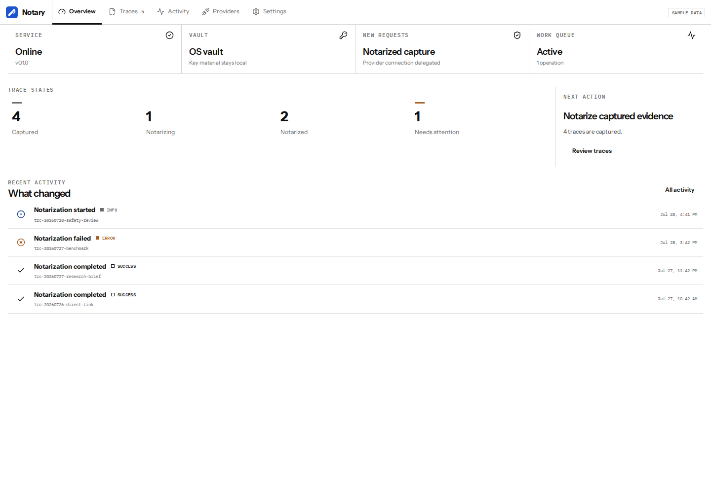
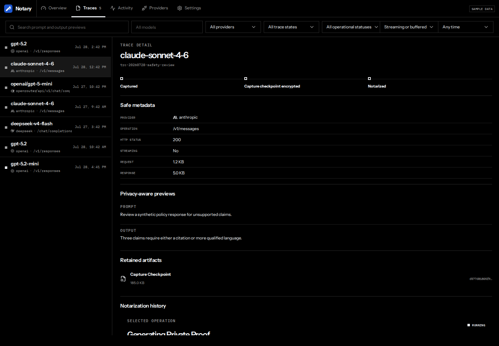
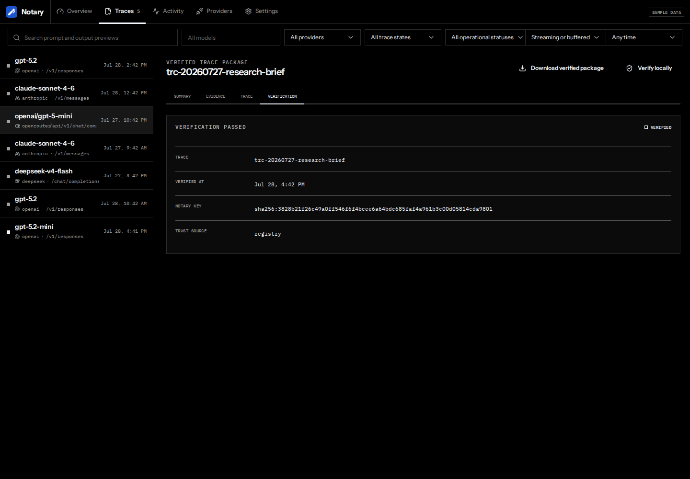
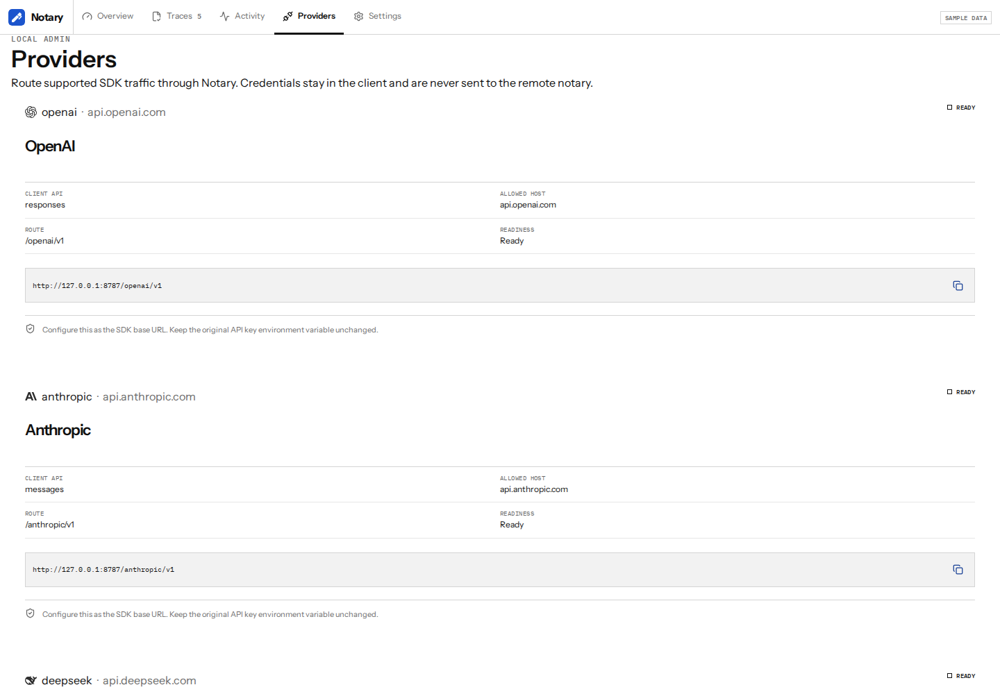
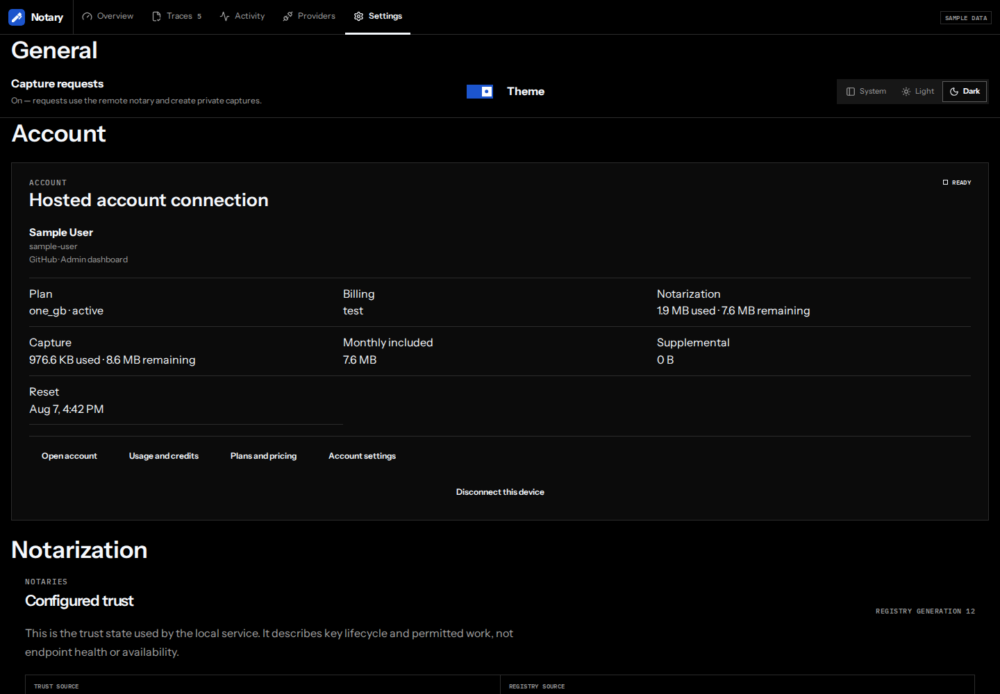
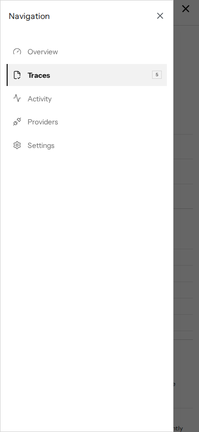
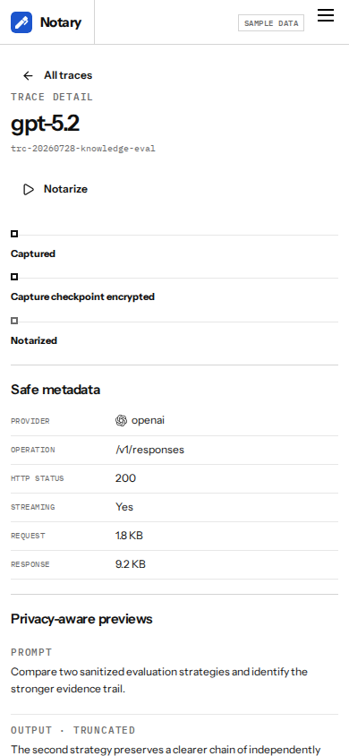

# Notary admin dashboard

Open [http://127.0.0.1:8788](http://127.0.0.1:8788) while `notaryd` is
running. The default local configuration opens the dashboard directly. If
`admin.auth` is configured, enter that administrator username and password.
The service exchanges them for an HttpOnly session and does not put the
password in a URL or browser storage.

The dashboard is the same compiled application in two contexts:

- **Local admin** is served only by the loopback administration listener. The
  provider proxy on port 8787 never serves it.
- **Cluster admin** is served through the authenticated admin HTTPS origin and
  reports public endpoints, the responding replica, shared backends, and
  deployment-managed update state.

The browser title is **Admin · Notary by Exalto**. Admin authentication is
separate from the optional hosted **Account** connection in Settings.

## Overview

Overview reports the service, vault, capture behavior, and work queue. Its
trace strip has exactly four counts: **Captured**, **Notarizing**,
**Notarized**, and **Needs attention**. Every count opens the unified Traces
workspace. Recent Activity uses bounded safe messages and identifiers.



The standalone navigation has exactly five destinations:

- **Overview** for readiness, work counts, and recent activity.
- **Traces** for every capture and notarization state.
- **Activity** for the safe operational event stream.
- **Providers** for supported provider routes and SDK setup.
- **Settings** for general, account, notarization, storage, service, and
  developer configuration.

Removed Milestone 1 URLs such as `#/captures`, `#/notarizations`, and
`#/sharing` are not aliases. They resolve to Overview.

## Traces

Traces is the one workspace for captured, capturing, failed, notarizing,
notarized, and interrupted work. Search uses stored privacy-aware previews.
Filters cover model, provider, trace state, operational status, streaming
mode, and time. Results are cursor-paginated and each row has a textual state;
color is only a secondary signal.



A captured successful provider response can be notarized once. Repeating the
action resolves to the same durable operation rather than creating parallel
work. The detail reports proof progress, attempts, timestamps, and safe failure
codes. Provider error responses stay visible but are not presented as eligible
for notarization.

For a notarized trace, the same route opens the disclosed prompt and response,
the evidence receipt, canonical OpenTelemetry trace, local verification, and
the exact `.llmtrace` package export. The source `.llmcapture` is
vault-encrypted retry state and is never a shareable package.

Share is a secondary action in this inspector. It first reviews the exact
package disclosure, publishing account, visibility, optional password, and
optional expiration. A disconnected user completes account approval without
leaving the Trace or uploading evidence merely by connecting. Share progress,
safe failure codes, link actions, access management, retry, and stop controls
remain inline. Stopping public access never deletes the local Trace or changes
its Notarized state. Expiration remains distinct from an explicit stop, so an
expired share can receive a new expiry through **Manage access** without a
misleading resume step.



Package availability is not a successful verification result. Only a passed
local verification confirms that the package evidence, disclosure, hashes,
provider mapping, and canonical trace agree.

## Activity

Activity keeps severity, date, and Trace ID visible and moves operation ID and
raw event name under **More filters**. Each filter is sent to the daemon; the
browser does not download a broad history for client-side filtering.
Trace-linked events open their Trace, while service-only events remain
inspectable. Messages and optional failure codes are bounded; they never
include request bodies, response bodies, raw headers, credential values, or
capture paths.

## Providers

Providers lists the daemon's explicit allowlist. Each record reports its name,
authenticated upstream host, client API, route prefix, readiness, and complete
proxy base URL. Copy the base URL into the provider SDK while leaving the SDK's
normal credential configuration unchanged. Provider credentials pass only
through the local proxy for the provider request and are never sent to the
remote notary.



Provider routes appear only here, not in Settings. A cluster deployment returns
its public proxy origins in the same provider resource; the browser does not
construct them from private listener addresses.

## Settings

Settings keeps these groups in a stable order:

1. **General** — capture behavior and System, Light, or Dark theme.
2. **Account** — optional hosted account connection, credits, and links.
3. **Notarization** — active notary, operator, endpoint, key identity,
   Registry generation and source, and lifecycle history.
4. **Security & storage** — vault, preview policy, metadata, and artifact
   backends.
5. **Service** — local listeners or cluster endpoints, versions, lifecycle,
   and update state.
6. **Developer** — the live generated OpenAPI document.



The capture switch changes daemon-owned durable behavior; it is not a browser
preference. With capture on, later supported requests use the remote notary and
create private evidence. With capture off, they pass directly to the provider
and create no evidence. Existing traces remain available.

Notary records describe configured trust and lifecycle windows, not endpoint
health. A record can accept new capture and notarization, allow only continued
notarization, remain only for historical verification, or be revoked. Missing
or malformed trust state is never displayed as healthy.

The hosted Account connection is optional for local capture, notarization,
download, and verification. Browser authorization never gives the dashboard a
hosted password or provider token. An API-key connection is identified but its
key value is neither returned nor managed here.

## Responsive and embedded modes

At 820 px and below, the menu opens as an accessible full-height drawer.
Selecting a trace changes the hash route and shows one detail panel with an
**All traces** back action; the list is not squeezed beside it.





The embedded desktop mode renders the same selected destination without the
standalone browser navigation. It does not maintain a second route model or a
second implementation of a destination.

## Troubleshooting

| Symptom | What to check |
| --- | --- |
| Service unavailable | Confirm `notaryd` is running and the browser uses the configured admin address, normally port 8788. |
| Unauthorized session | Confirm `admin.auth`, then enter that administrator username and password. Never add the password to the URL. |
| Vault unavailable | Unlock the configured credential store or private passphrase source, then restart. Do not move encrypted checkpoints outside their initialized vault profile. |
| Provider unavailable | Open Providers and check the explicit readiness and upstream host. Do not substitute an unlisted hostname. |
| Notary Registry unavailable | Check network and Registry configuration. An explicit endpoint is appropriate only for local or self-hosted development. |
| Operation interrupted | Inspect the Trace's safe attempt history and retry only when the service marks it retryable. |
| Missing artifact | Keep metadata and its filesystem directory or private object prefix together. The API intentionally does not accept a replacement path or object key. |
| Safe failure code | Use the code for diagnosis, then inspect local process logs. Logs omit credentials, headers, and evidence plaintext but may contain configured paths, so do not share them verbatim. |

## Documentation fixture and screenshots

All images above come from `apps/admin-dashboard/src/fixtures.ts`. The data is
synthetic and fixed: it contains no real prompts, provider keys, account names,
local paths, or checkpoint contents. The dashboard labels this state **Sample
data**. Interactive fixture actions stay in the browser and contact no
provider, notary, account service, or sharing platform.

Regenerate the images from `runtime/` after a dashboard change:

```bash
npm --prefix apps/admin-dashboard ci
npx --prefix apps/admin-dashboard playwright install chromium
npm --prefix apps/admin-dashboard run capture:dashboard-docs
npm --prefix apps/admin-dashboard run check:local-docs
```

The capture command uses fixed UTC fixture time, locale, viewport, and color
mode. Review every image for sensitive data and layout regressions before
committing it.
